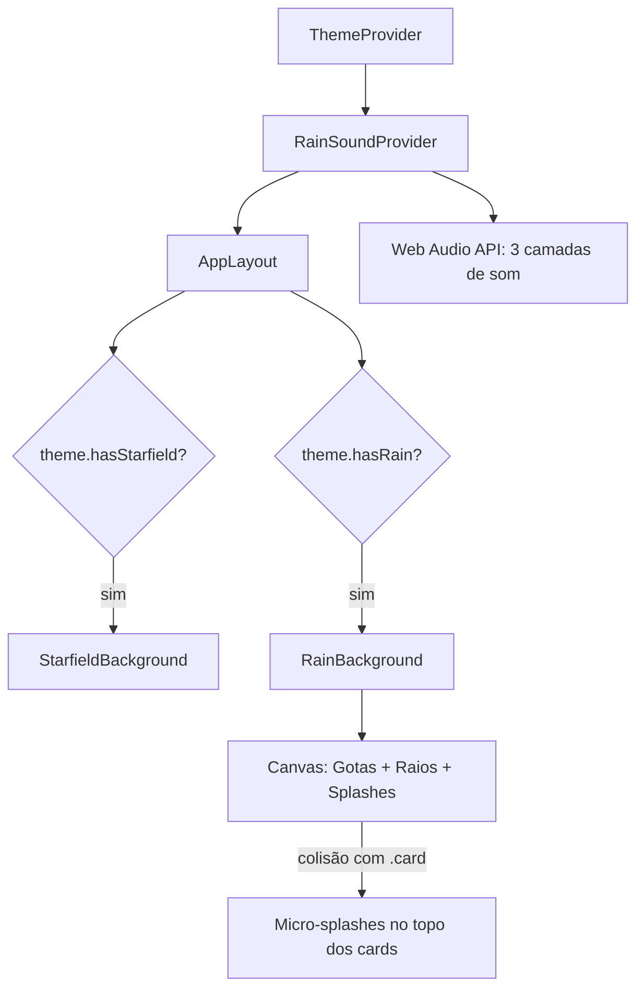
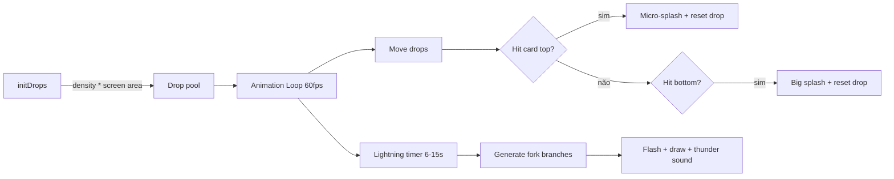

# Sistema de Temas Dinâmicos — Guia de Implementação

> Guia completo para implementar o sistema de temas com **Starfield**, **Chuva com respingos nos cards**, **Raios procedurais** e **Som ambiente (Web Audio API)** em qualquer projeto React + TypeScript.

---

## Índice

1. [Arquitetura](#arquitetura)
2. [Dependências](#dependências)
3. [Passo 1 — ThemeContext](#passo-1--themecontext)
4. [Passo 2 — CSS Variables](#passo-2--css-variables)
5. [Passo 3 — StarfieldBackground](#passo-3--starfieldbackground)
6. [Passo 4 — RainBackground](#passo-4--rainbackground)
7. [Passo 5 — RainSoundContext](#passo-5--rainsoundcontext)
8. [Passo 6 — Layout Integration](#passo-6--layout-integration)
9. [Passo 7 — Settings UI](#passo-7--settings-ui)
10. [Prompt para IA](#prompt-para-ia)
11. [Criando Novos Temas](#criando-novos-temas)

---

## Arquitetura

```
src/
├── contexts/
│   ├── ThemeContext.tsx        # Temas + CSS variables
│   └── RainSoundContext.tsx    # Som de chuva (Web Audio API)
├── components/ui/
│   ├── StarfieldBackground.tsx # Canvas SVG com parallax
│   └── RainBackground.tsx     # Canvas com gotas, raios, splashes
└── components/layout/
    └── AppLayout.tsx           # Integra backgrounds condicionalmente
```



---

## Dependências

```bash
# Apenas React — sem bibliotecas externas para os efeitos
npm install react react-dom
# Ícones (opcional, para Settings UI)
npm install lucide-react
```

> **Zero dependências externas** para os efeitos visuais e sonoros. Tudo é canvas nativo + Web Audio API.

---

## Passo 1 — ThemeContext

O coração do sistema. Define tipos, cores e flags que controlam quais efeitos visuais cada tema ativa.

### Conceitos-chave

| Propriedade | Tipo | Função |
|---|---|---|
| `hasStarfield` | `boolean` | Ativa canvas de estrelas com parallax |
| `hasRain` | `boolean` | Ativa canvas de chuva + raios |
| `rainDensity` | `number` | Multiplicador de gotas (0.3 = chuvisco, 1.3 = tempestade) |
| `isDark` | `boolean` | Controla cores das partículas e classe CSS `dark` |

### Código: `src/contexts/ThemeContext.tsx`

```tsx
import { createContext, useContext, useEffect, useState, ReactNode } from 'react';

// ── 1. Defina os IDs dos temas ──
export type ThemeId = 'light' | 'dark' | 'rain' | 'storm' | 'drizzle';
// Adicione quantos quiser

// ── 2. Interface de configuração ──
export interface ThemeConfig {
  id: ThemeId;
  name: string;
  isDark: boolean;
  hasStarfield: boolean;
  hasRain?: boolean;
  rainDensity?: number; // 0.3 = chuvisco, 1.0 = normal, 1.3 = tempestade
  // Cores do design system
  bg: string;
  bgCard: string;
  bgSidebar: string;
  bgTopbar: string;
  textPrimary: string;
  textSecondary: string;
  textMuted: string;
  border: string;
  accent: string;
  accentLight: string;
  gradientFrom: string;
  gradientTo: string;
}

// ── 3. Registro de temas ──
export const THEMES: Record<ThemeId, ThemeConfig> = {
  light: {
    id: 'light', name: 'Claro', isDark: false, hasStarfield: true,
    bg: '#f8f8fb',
    bgCard: 'rgba(255,255,255,0.85)',
    bgSidebar: 'rgba(255,255,255,0.92)',
    bgTopbar: 'rgba(255,255,255,0.85)',
    textPrimary: '#1a1a2e',
    textSecondary: '#6b7280',
    textMuted: '#9ca3af',
    border: 'rgba(0,0,0,0.06)',
    accent: '#f97316',
    accentLight: 'rgba(249,115,22,0.1)',
    gradientFrom: '#f97316',
    gradientTo: '#3b82f6',
  },
  dark: {
    id: 'dark', name: 'Escuro', isDark: true, hasStarfield: true,
    bg: '#0B0B0B',
    bgCard: 'rgba(255,255,255,0.04)',
    bgSidebar: 'rgba(255,255,255,0.03)',
    bgTopbar: 'rgba(255,255,255,0.04)',
    textPrimary: '#f0f0f0',
    textSecondary: '#a0a0a0',
    textMuted: '#666666',
    border: 'rgba(255,255,255,0.08)',
    accent: '#60a5fa',
    accentLight: 'rgba(96,165,250,0.12)',
    gradientFrom: '#3b82f6',
    gradientTo: '#8b5cf6',
  },
  rain: {
    id: 'rain', name: 'Chuva', isDark: true,
    hasStarfield: false, hasRain: true, rainDensity: 1,
    bg: '#0c1117',
    bgCard: 'rgba(100,150,200,0.05)',
    bgSidebar: 'rgba(100,150,200,0.04)',
    bgTopbar: 'rgba(100,150,200,0.05)',
    textPrimary: '#c8d6e5',
    textSecondary: '#7f8fa6',
    textMuted: '#576574',
    border: 'rgba(100,150,200,0.1)',
    accent: '#74b9ff',
    accentLight: 'rgba(116,185,255,0.12)',
    gradientFrom: '#74b9ff',
    gradientTo: '#0984e3',
  },
  storm: {
    id: 'storm', name: 'Tempestade', isDark: true,
    hasStarfield: false, hasRain: true, rainDensity: 1.3,
    bg: '#050505',
    bgCard: 'rgba(255,255,255,0.025)',
    bgSidebar: 'rgba(255,255,255,0.02)',
    bgTopbar: 'rgba(255,255,255,0.025)',
    textPrimary: '#b0b0b0',
    textSecondary: '#707070',
    textMuted: '#505050',
    border: 'rgba(255,255,255,0.05)',
    accent: '#808080',
    accentLight: 'rgba(128,128,128,0.08)',
    gradientFrom: '#a0a0a0',
    gradientTo: '#505050',
  },
  drizzle: {
    id: 'drizzle', name: 'Chuvisco', isDark: false,
    hasStarfield: false, hasRain: true, rainDensity: 0.3,
    bg: '#faf5ef',
    bgCard: 'rgba(255,255,255,0.7)',
    bgSidebar: 'rgba(255,255,255,0.8)',
    bgTopbar: 'rgba(255,255,255,0.7)',
    textPrimary: '#3d2c1a',
    textSecondary: '#8b7355',
    textMuted: '#b09878',
    border: 'rgba(0,0,0,0.06)',
    accent: '#e67e22',
    accentLight: 'rgba(230,126,34,0.1)',
    gradientFrom: '#e67e22',
    gradientTo: '#e74c3c',
  },
};

// ── 4. Aplicar CSS variables no :root ──
function applyThemeVars(t: ThemeConfig) {
  const root = document.documentElement;
  root.style.setProperty('--app-bg', t.bg);
  root.style.setProperty('--app-bg-card', t.bgCard);
  root.style.setProperty('--app-bg-sidebar', t.bgSidebar);
  root.style.setProperty('--app-bg-topbar', t.bgTopbar);
  root.style.setProperty('--app-text-primary', t.textPrimary);
  root.style.setProperty('--app-text-secondary', t.textSecondary);
  root.style.setProperty('--app-text-muted', t.textMuted);
  root.style.setProperty('--app-border', t.border);
  root.style.setProperty('--app-accent', t.accent);
  root.style.setProperty('--app-accent-light', t.accentLight);
  root.style.setProperty('--app-gradient-from', t.gradientFrom);
  root.style.setProperty('--app-gradient-to', t.gradientTo);
  t.isDark ? root.classList.add('dark') : root.classList.remove('dark');
}

// ── 5. Provider + Hook ──
interface ThemeContextType {
  theme: ThemeConfig;
  themeId: ThemeId;
  setTheme: (id: ThemeId) => void;
  isDark: boolean;
}

const ThemeContext = createContext<ThemeContextType | undefined>(undefined);

export function ThemeProvider({ children }: { children: ReactNode }) {
  const [themeId, setThemeId] = useState<ThemeId>(() => {
    const saved = localStorage.getItem('app-theme');
    return (saved && saved in THEMES) ? saved as ThemeId : 'dark';
  });

  const theme = THEMES[themeId];

  useEffect(() => {
    applyThemeVars(theme);
    localStorage.setItem('app-theme', themeId);
  }, [themeId, theme]);

  return (
    <ThemeContext.Provider value={{ theme, themeId, setTheme: setThemeId, isDark: theme.isDark }}>
      {children}
    </ThemeContext.Provider>
  );
}

export function useTheme() {
  const ctx = useContext(ThemeContext);
  if (!ctx) throw new Error('useTheme must be used within ThemeProvider');
  return ctx;
}
```

---

## Passo 2 — CSS Variables

No seu `index.css`, use as variables para estilizar todo o app:

```css
/* Reset base */
body {
  background: var(--app-bg);
  color: var(--app-text-primary);
  transition: background 0.3s, color 0.3s;
}

/* Card genérico — IMPORTANTE: use esta classe para splash de chuva */
.app-card {
  background: var(--app-bg-card);
  border: 1px solid var(--app-border);
  border-radius: 1rem;
  backdrop-filter: blur(12px);
}

/* Gradient text */
.gradient-text {
  background: linear-gradient(135deg, var(--app-gradient-from), var(--app-gradient-to));
  -webkit-background-clip: text;
  -webkit-text-fill-color: transparent;
}

/* Accent */
.accent-bg { background: var(--app-accent); }
.accent-text { color: var(--app-accent); }
```

> **IMPORTANTE**: Os respingos de chuva nos cards dependem de um seletor CSS. Mude `.arrow-card` para `.app-card` (ou seu seletor) no `RainBackground.tsx`.

---

## Passo 3 — StarfieldBackground

Efeito de estrelas com **parallax no scroll**, **sparkle shapes** (4 pontas), **twinkle animation** e suporte claro/escuro.

### Como funciona

1. **3 camadas SVG** com estrelas de tamanhos e velocidades diferentes
2. **Parallax**: cada camada se move em velocidade diferente no scroll
3. **Twinkle**: 22% das estrelas piscam com animação CSS
4. **Seed RNG**: posições são determinísticas (mesmas estrelas sempre)

### Código completo

Copie o arquivo `StarfieldBackground.tsx` do projeto Arrow. Pontos de customização:

```tsx
// Ajuste LAYERS para controlar densidade e velocidade
const LAYERS = [
  { count: 120, minR: 1.0, maxR: 1.5, minO: 0.25, maxO: 0.55, speed: 0.06 },
  { count: 90,  minR: 1.5, maxR: 2.5, minO: 0.25, maxO: 0.55, speed: 0.13 },
  { count: 50,  minR: 2.5, maxR: 3.8, minO: 0.22, maxO: 0.45, speed: 0.22 },
];

// Ajuste cores para sua marca
const ACCENT_DARK  = 'rgba(162,255,76,';   // cor accent das estrelas (modo escuro)
const WHITE_DARK   = 'rgba(215,230,255,';  // cor base (modo escuro)
const ACCENT_LIGHT = 'rgba(80,130,30,';    // cor accent (modo claro)
const BASE_LIGHT   = 'rgba(30,30,60,';     // cor base (modo claro)
```

### Uso

```tsx
{theme.hasStarfield && <StarfieldBackground isDark={theme.isDark} />}
```

---

## Passo 4 — RainBackground

Canvas com **gotas de chuva**, **raios procedurais**, **splashes no chão** e **splashes nos cards**.

### Como funciona



### Pontos de customização

```tsx
// Densidade de gotas (controlada pelo tema)
const count = Math.floor((w * h) / 3000 * density);

// Velocidade e tamanho adaptam com density
speed: (8 + Math.random() * 8) * (0.6 + density * 0.4),
length: (10 + Math.random() * 15) * (0.7 + density * 0.3),

// Opacidade reduzida para temas claros
opacity: (0.1 + Math.random() * 0.25) * (isDark ? 1 : 0.5),

// Cores adaptativas
const dropColor = isDark ? '160, 185, 220' : '80, 100, 140';

// Seletor de cards — MUDE PARA SEU SELETOR
const cards = document.querySelectorAll('.app-card'); // ← seu seletor aqui

// Intervalo de raios (ms)
if (time - lastLightning > 6000 + Math.random() * 9000) { /* trigger */ }

// Ângulo de vento
const windAngle = 0.12; // inclinação das gotas
```

### Detalhes do splash nos cards

```tsx
// Scan de posições a cada 500ms (performance)
if (time - lastCardScan > 500) {
  const cards = document.querySelectorAll('.app-card');
  cardRects = Array.from(cards).map(el => el.getBoundingClientRect());
}

// Colisão: gota cruza o topo do card
if (prevY < cardTop && drop.y >= cardTop &&
    drop.x >= rect.left - 5 && drop.x <= rect.right + 5) {
  // Micro-splash: menor, mais curto, mais sutil
  splashes.push({
    x: drop.x, y: cardTop,
    vx: (Math.random() - 0.5) * 1.5,  // velocidade lateral reduzida
    vy: -(0.5 + Math.random() * 1.5),  // velocidade vertical reduzida
    maxLife: 6 + Math.random() * 8,     // vida curta
    size: 0.3 + Math.random() * 0.5,    // partículas menores
  });
}
```

---

## Passo 5 — RainSoundContext

Som de chuva 100% procedural via **Web Audio API** — zero arquivos de áudio.

### Arquitetura de áudio

```
MasterGain (fade in 2s)
├── Layer 1: Rain Patter
│   └── Noise → BandPass(2500Hz) → Gain(0.5)
├── Layer 2: Deep Ambience
│   └── Noise → LowPass(300Hz) → Gain(0.35)
└── Layer 3: Surface Hiss
    └── Noise → HighPass(5000Hz) → Gain(0.2)

Thunder (triggered by lightning):
    Noise × Envelope(crack + rumble) → LowPass(200Hz) → Gain
```

### Configuração de intensidades

```tsx
const INTENSITY_CONFIG = {
  sutil: {     // Chuva leve, sem trovão
    master: 0.12, rain: 0.3, ambience: 0.15, hiss: 0.08,
    rainFreq: 3500, ambFreq: 200,
  },
  moderada: {  // Chuva constante
    master: 0.3, rain: 0.5, ambience: 0.35, hiss: 0.2,
    rainFreq: 2500, ambFreq: 300,
  },
  intensa: {   // Tempestade
    master: 0.5, rain: 0.7, ambience: 0.55, hiss: 0.35,
    rainFreq: 2000, ambFreq: 400,
  },
};
```

### Comunicação Lightning → Thunder

```tsx
// RainSoundContext expõe via window global:
(window as any).__playThunder = () => { /* gera trovão */ };

// RainBackground chama quando gera raio:
const playThunder = (window as any).__playThunder;
if (playThunder) setTimeout(playThunder, 200 + Math.random() * 1200);
```

> O delay aleatório simula a distância do raio (som viaja mais devagar que luz).

---

## Passo 6 — Layout Integration

```tsx
// AppLayout.tsx
import { StarfieldBackground } from '@/components/ui/StarfieldBackground';
import { RainBackground } from '@/components/ui/RainBackground';

function Layout() {
  const { theme } = useTheme();

  return (
    <div style={{ background: theme.bg }}>
      {theme.hasStarfield && <StarfieldBackground isDark={theme.isDark} />}
      {theme.hasRain && <RainBackground />}

      {/* Sidebar, TopBar, Content */}
      <main className="relative z-10">
        <Outlet />
      </main>
    </div>
  );
}
```

### Provider stack no App.tsx

```tsx
<ThemeProvider>
  <RainSoundProvider>
    <BrowserRouter>
      <Routes>...</Routes>
    </BrowserRouter>
  </RainSoundProvider>
</ThemeProvider>
```

> **Ordem importa**: `RainSoundProvider` precisa estar dentro de `ThemeProvider` (usa `useTheme`).

---

## Passo 7 — Settings UI

Seletor de temas + controle de som:

```tsx
const { theme, themeId, setTheme } = useTheme();
const { intensity, setIntensity, isPlaying } = useRainSound();

// Grid de temas
{Object.values(THEMES).map(t => (
  <button key={t.id} onClick={() => setTheme(t.id)}
    style={{ border: themeId === t.id ? '2px solid var(--app-accent)' : '...' }}>
    <div style={{ background: t.bg }}>{/* mini preview */}</div>
    <span>{t.name}</span>
  </button>
))}

// Controle de som (só aparece quando tema tem chuva)
{theme.hasRain && (
  <div>
    {['off', 'sutil', 'moderada', 'intensa'].map(level => (
      <button key={level} onClick={() => setIntensity(level)}>
        {level}
      </button>
    ))}
  </div>
)}
```

---

## Prompt para IA

Use este prompt para pedir a uma IA que implemente o sistema no seu projeto:

```
Implemente um sistema de temas dinâmicos com efeitos visuais para meu projeto React + TypeScript.

REQUISITOS:
1. ThemeContext com CSS variables dinâmicas aplicadas no :root
2. Persistência de tema via localStorage
3. StarfieldBackground (SVG): estrelas com parallax no scroll, twinkle, 3 camadas
4. RainBackground (Canvas): gotas com vento, respingos no chão E no topo dos cards (.meu-card), raios procedurais com fork branches
5. RainSoundContext (Web Audio API): som de chuva procedural com 3 camadas (patter, ambience, hiss), 3 intensidades (sutil/moderada/intensa), trovão sincronizado com raios
6. Cada tema tem flags: hasStarfield, hasRain, rainDensity
7. Cores das partículas adaptam para isDark (escuro: azul claro, claro: azul escuro)
8. rainDensity controla: quantidade de gotas, velocidade, tamanho
9. Sem trovão no modo sutil
10. Scan de card positions a cada 500ms para performance
11. Micro-splashes nos cards: menores e mais curtos que no chão

TEMAS PARA CRIAR:
- Claro com starfield
- Escuro com starfield
- Chuva (escuro, azul, density 1.0)
- Tempestade (escuro monocromático, density 1.3)
- Chuvisco (claro, tons de pôr do sol, density 0.3)

ESTRUTURA:
- contexts/ThemeContext.tsx
- contexts/RainSoundContext.tsx
- components/ui/StarfieldBackground.tsx
- components/ui/RainBackground.tsx

Meu seletor de cards é: .meu-card
Meu prefixo de CSS variables é: --app-
```

---

## Criando Novos Temas

### Template para tema com starfield

```tsx
meuTema: {
  id: 'meuTema', name: 'Meu Tema',
  isDark: true,        // true = escuro, false = claro
  hasStarfield: true,  // ativa estrelas
  hasRain: false,      // sem chuva
  bg: '#0a0e1a',
  bgCard: 'rgba(255,255,255,0.05)',
  bgSidebar: 'rgba(255,255,255,0.03)',
  bgTopbar: 'rgba(255,255,255,0.05)',
  textPrimary: '#e2e8f0',
  textSecondary: '#94a3b8',
  textMuted: '#64748b',
  border: 'rgba(255,255,255,0.08)',
  accent: '#60a5fa',
  accentLight: 'rgba(96,165,250,0.12)',
  gradientFrom: '#3b82f6',
  gradientTo: '#8b5cf6',
},
```

### Template para tema com chuva

```tsx
meuTemaChuvoso: {
  id: 'meuTemaChuvoso', name: 'Chuvoso',
  isDark: true,
  hasStarfield: false,  // desativa estrelas
  hasRain: true,        // ativa chuva
  rainDensity: 0.8,     // 0.3 = chuvisco, 1.0 = normal, 1.3+ = tempestade
  bg: '#0c1117',
  bgCard: 'rgba(100,150,200,0.05)',
  // ... demais cores
},
```

### Guia de rainDensity

| Valor | Efeito | Uso ideal |
|---|---|---|
| `0.2-0.3` | Chuvisco leve, gotas lentas | Temas claros, relaxantes |
| `0.5-0.8` | Chuva moderada | Balanço entre visual e performance |
| `1.0` | Chuva padrão | Tema escuro principal |
| `1.2-1.5` | Tempestade densa | Temas sombrios, dramáticos |
| `2.0+` | Dilúvio (cuidado: performance) | Efeito especial/demonstração |

---

## Checklist de Implementação

- [ ] Criar `ThemeContext.tsx` com tipos e CSS variables
- [ ] Criar `StarfieldBackground.tsx` (SVG + parallax)
- [ ] Criar `RainBackground.tsx` (Canvas + gotas + raios + splashes)
- [ ] Criar `RainSoundContext.tsx` (Web Audio API)
- [ ] Adicionar providers no App.tsx (ThemeProvider > RainSoundProvider)
- [ ] Renderizar backgrounds condicionalmente no Layout
- [ ] Adicionar seletor de temas nas Settings
- [ ] Adicionar controle de som de chuva nas Settings
- [ ] Testar troca de tema (deve limpar efeito anterior)
- [ ] Testar som (fade in/out, trovão sincronizado)
- [ ] Verificar performance (devTools > Performance tab)
- [ ] Ajustar `rainDensity` por tema

---

## Referência: Arquivos Completos

Os arquivos completos de referência estão no repositório Arrow:

| Arquivo | Caminho | Linhas |
|---|---|---|
| ThemeContext | `src/contexts/ThemeContext.tsx` | ~277 |
| RainSoundContext | `src/contexts/RainSoundContext.tsx` | ~240 |
| StarfieldBackground | `src/components/ui/StarfieldBackground.tsx` | ~207 |
| RainBackground | `src/components/ui/RainBackground.tsx` | ~284 |

> Copie estes arquivos diretamente e ajuste: seletor de cards, prefixo CSS, cores accent.

---

*Sistema de Temas Arrow — Criado para o projeto Arrow v2.0*
*Reutilizável em qualquer projeto React + TypeScript*
